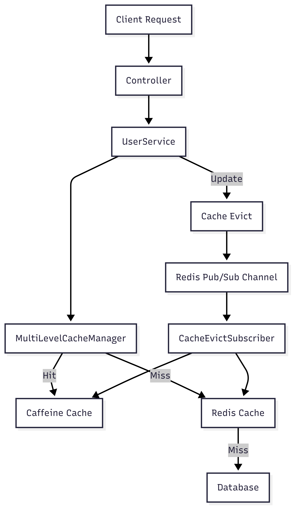

# Spring Boot Multi-Level Cache 예시 구현

Spring Boot 기반 **멀티 레벨 캐시 아키텍처** 예제입니다.  
로컬 환경에서의 캐시(Caffeine) + 분산 캐시(Redis) 조합을 사용하고,  
Redis Pub/Sub을 통해 멀티 인스턴스 환경에서 **캐시 무효화 동기화**를 구현했습니다.

---
## Features

- **멀티 레벨 캐시**
    - 1차 캐시: Caffeine (JVM 메모리)
        - 각 서버 인스턴스의 메모리에 존재
        - 읽기 성능 매우 빠름 (나노초 단위)
        - 단점: 여러 서버 간 데이터 불일치 발생 가능
    - 2차 캐시: Redis (분산 캐시)
        - 모든 서버 인스턴스가 공유
        - 데이터 일관성 보장
        - 단점: 네트워크 오버헤드 발생
    - MultiLevelCache 전략
        - 조회: Caffeine → Redis → DB 순서
        - Redis에 존재하면 Caffeine에 Write-Through 저장 (핫 데이터 최적화)

- **캐시 무효화 Pub/Sub**
    - `@CacheEvict` 시 Redis Pub/Sub 채널(`cacheEvictChannel`)로 메시지 발행
    - 모든 인스턴스의 로컬 캐시(Caffeine)에서 해당 키 무효화
    - 서버 간 데이터 일관성 유지

- **Spring Cache 추상화**
    - `@Cacheable`, `@CacheEvict` 어노테이션 기반
    - 프록시 레벨에서 캐싱 투명 처리

- **테스트 커버리지**
    - 캐시 적중 성능 검증
    - 캐시 무효화 및 Pub/Sub 동작 검증
---

## Architecture



---

## Tech Stack

- Java 17

- Spring Boot 3.x

- Spring Cache Abstraction

- Caffeine Cache

- Redis (with Pub/Sub)

- JUnit 5

---
## API Examples
- 캐시조회 (첫 호출은 느림)

1. DB 조회 → 캐시에 저장
````
GET http://localhost:8080/users/1

{
  "id": 1,
  "name": "User-1"
}
````
1-1 Controller → Service 호출

- @Cacheable("users") 확인
- Caffeine → Redis 순서로 캐시 조회

1-2 캐시에 없으면 simulateSlowService() 실행
- DB에서 결과 반환 + 캐시에 저장

1-3다음 요청부터는 Caffeine에서 즉시 조회 (빠름)
- 캐시에서 바로 반환
````
{
  "id": 1,
  "name": "User-1"
}
````
2. 업데이트 시 캐시 무효화로 서버 간 불일치 방지
````
PUT http://localhost:8080/users/1
Content-Type: application/json

{
  "id": 1,
  "name": "Updated-User-1"
}
````
response
````
{
  "id": 1,
  "name": "Updated-User-1"
}
````

2-1 Controller → Service 호출

- DB 저장 로직 실행

- @CacheEvict로 users:1 캐시 제거

- redisTemplate.convertAndSend("cacheEvictChannel", "1") 실행

2-2 Redis Pub/Sub 동작

- 모든 서버 인스턴스의 CacheEvictSubscriber가 메시지를 수신

- 각자의 Caffeine 캐시에서 users:1 무효화

결과

- 다음 요청 시 → Redis 또는 DB에서 최신 데이터 조회

- 다시 Caffeine에 캐싱됨

정리

- 빠른 조회: 1차 Caffeine 캐시 덕분에 응답 속도 극대화

- 일관성 보장: Redis Pub/Sub 기반 캐시 무효화로 서버 간 불일치 방지

- 확장성: 서버 인스턴스 수가 늘어나도 캐시 동기화 가능